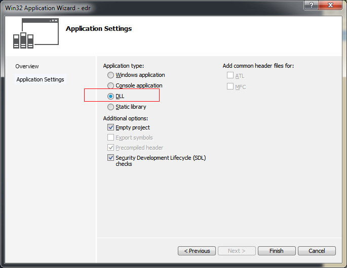

## 之前内容
********   
    WORD wYear;
    WORD wMonth;
    WORD wDayOfWeek;
    WORD wDay;
    WORD wHour;
    WORD wMinute;
    WORD wSecond;
    WORD wMilliseconds;


//右键文件属性

Windows数据结构
typedef struct _WIN32_FILE_ATTRIBUTE_DATA{
	

}


Windows数据类型与Windows API函数

所有的windows函数都有 W版和A版

int MessageBoxW(
    HWND hWnd,
    LPCWSTR lpText,
    LPCWSTR lpCaption,
    UINT uType
);
BOOL ReadFile(HANDLE hFile,);


C是专门用来开发操作系统的语言
windows也是c语言开发出来的


c语言数据类型 
int float double...

windows数据类型
(用c语言做出一些新的数据类型),都是大写
BOOL BYTE CHAR
CONST DWORD DWORD32
DWORD64 FLOAT HANDLE 
HICON HINSTANCE HKEY


Windows API 动态链接库(DLL)

kernel32.dll  949个API函数
user32.dll    732个API函数
gdi32.dll     ...

几万个 几十万个,所有就像学英语单词,牛津高阶 8 万

太多,可以什么时候用什么时候学


void CDemoDDlg::OnBnClickedButton1()
{
	// TODO: Add your control notification handler code here

	//这个是真正的windows api

	//windows api 都在全局的名称空间里,所以 打上4个点就可以找到了
	::MessageBox(NULL, TEXT("Hello MFC"), TEXT("标题"), MB_OK);
}


void CDemoDDlg::OnBnClickedButton2()
{
	// TODO: Add your control notification handler code here
	//用C++包装之后的 win api,及mfc

	//这里MessageBox是 CDemoDDlg的类的成员函数,所以可以直接调用

	//实际是等价于CDemoDDlg::MessageBox(TEXT("Hello MFC"));
	MessageBox(TEXT("Hello MFC"));
}

void CDemoDDlg::OnBnClickedButton3()
{
	// TODO: Add your control notification handler code here

	//有做了包装,在任何地方都可以使用,在类的外面 里面都可以
	AfxMessageBox(TEXT("Hello AfxMessageBox"));
}


CS_HREDRAW：当窗体的宽度发生变化时，就重新绘制窗口。

CS_VREDRAW：当窗体的高度发生变化时，就重新绘制窗口。

CS_DBLCLKS：能接收用户在窗体总的双击事件。

CS_OWNDC：为该类中的每一个窗口分配各自独立的设备环境。

CS_NOCLOSE：禁用系统菜单中的“关闭”命令。

CS_CLASSDC：为该窗口类的各窗口分配一个共享的设备环境。

CS_PARENTDC：指定子窗口继承其父窗口的设备环境。、

CS_SAVEBITS：把被窗口遮掩的屏幕图像部分作为位图保存起来。当该窗口被移动时，windows使用被保存的位图来重建屏幕图像。


  今天在做一个软件时，发现win32创建的窗体不能响应WM_LBUTTONDBLCLK消息。在一番谷歌百度之后，终于找到了解决方法；废话少说，言归正传。

窗体不响应WM_LBUTTONDBLCLK消息，只要在注册窗口类的时候在WNDCLASS的style成员加上CS_DBLCLKS风格就行了。


Prefix Constant

CS Class style option
CW Create window option
DT Draw text option
IDI ID number for an icon
IDC ID number for a cursor
MB Message box options
SND Sound option
WM Window message
WS Window style


The cb prefix stands for "count of bytes"


HINSTANCE hPrevInstance


 All instances of the same application shared code and read-only
memory (usually resources such as menu and dialog box templates). Aprogram could determine if
other instances of itself were running by checking the hPrevInstance parameter. It could then skip
certain chores and move some data from the previous instance into its own data area.
In the 32-bit versions of Windows, this concept has been abandoned. The second parameter to
WinMain is always NULL (defined as 0).


 sz stands for "string terminated
with a zero.


#include <stdio.h>
The name of the library is not case sensitive. This means that you can write it as STDIO.H without any problem.


外国人的发明的东西或技术 都是很有针对性,即针对特定的问题,都希望能在最短时间内见效,比如西医,西洋拳等


可以抱着这种观点去学习编程等的技术.


屯屯屯屯屯屯屯屯
烫烫烫烫烫烫烫烫
屯烫屯烫屯烫屯烫


学习心得
    学一些从未接触过的东西 可能总是痛苦的, 但坚持过后,就会 熟悉了


C Run-Time Library 

CRT


右移是算术移位,左端补符号位
左移是逻辑移位,右端补0

int b;
b>>31 其结果是 0 则为正,是-1 则为负. 
即b>>31得到了符号位


位运算 还是内存里的运算吗

内存里的的排列顺序有小端和大端

而位运算内部 肯定了这个大端小端的不同吧!!

统一用通常人理解模型的 大端吧!!!!!

但还是 按补码来运算的!!!!!!


教书时可用 struct 的地址连续 越界 惹的祸

#include<stdio.h>
struct {
	int data[4];
	int len;
}s;
int main()
{
	int data[5] = { 1, 2, 3, 4, 9 };
	s.len = -1;
	for (int i = 0; i < 5; i++){
		s.data[i] = data[i];
	}


	getchar();
	return 0;
}


烫烫烫烫烫烫烫烫烫烫烫烫烫烫烫烫


stdafx
standard application framework extensions


方式一：
#ifndef _SOMEFILE_H_
#define _SOMEFILE_H_
.......... // 一些声明语句
#endif
方式二：
#pragma once
... ... // 一些声明语句

还是 方式二简单


CRT c runtime library c语言运行时库


_CRT_SECURE_NO_WARNINGS;_UNICODE;UNICODE;%(PreprocessorDefinitions)


sprintf(),格式化字符串变量


Legend分析


cout<<(int*)ptr  这样可以输出地址


short tell[10];

数组的类型就是数组 只不过其值 被解释为其第一个元素的地址
tell 数组名被解释为其第一个元素的地址	是一个 short大小的内存
	
&tell被解释为 整个数组的地址		是一个10个short大小的内存

&tell 是 数组的指针 类型

tell+1 是将地址+2
&tell+1是将地址+20

[]的优先级 比 * 高


sizeof 得出几个字节

sizeof对数组名 是数组的大小 按字节计算
sizeof对指针   是指针的大小 是4个字节

蒙特卡罗法 计算圆周率 计算不规则图形的面积


不要释放已经释放过的指针 ,这时什么情况都有可能发生


再对指针使用 解除引用(*) 时,要保证 其不是野指针,即是经过初始化的指针.


c++ struct =号赋值 即使成员是 char[]  也全部复制,新的char[] 有了一个新的地址


cin.get(arr,len)保留换行符在输入序列中
而 cin.getline(arr,len)随即丢弃换行符

cin.get(arr,10).get(); <==>cin.getline(arr,10);

##4 系统目录
********
* 获取系统目录信息,并写入文件中
* API函数
    * GetSystemDirectory()
    * CreateFile()
    * WriteFile()
    * CloseHandle();
  
MAX_PATH 260

最长是260 windows系统最长的名字是260

GetSystemDirectory()这个文件夹里保存这windows的核心
  
##5 创建窗口及消息处理
********
* 两种方法
    * 向导自动创建 win32 demoA
    * 手写代码创建窗口
* 两个函数 就可以了
* 十多个API函数

> ** 做windows的核心也是处理windows消息 **

> ** 窗口类的名称(lpClassName)要一致 **


## 7 使用对话框资源创建窗口
*****************
* 对话框资源(可以进行可视化的设计)
* 可视化设计

用对话框资源来创建窗口

代替了 创建窗口类,注册窗口类,创建窗口,显示窗口

## 8 使用MFC创建对话框窗口
******************
* MFC->使用C++类分支Windows API
    * 封装 WinMain()
    * 封装消息循环
    * 封装窗口过程
* 可视化设计

电脑操作->windows消息 <-> 窗口过程
    
## 9 宽字符
********
```
char      wchar_t
printf    wprintf
strlen    wcslen
strcpy    wcscpy
strcat    wcscat
strstr    wcsstr
```
936


## 10 三种版本
************

只要处理字符集,就分三个版本

windows里的 跟字符串有关的数据类型,函数都有三个版本
* 数据类型 

现在都大写了

A版 W版 T版
T版要么变成A版,要么变成W版

T是通用版,是一个宏,会根据具体的实际来确定用哪个
```
CHAR     WCHAR      TCHAR
PCHAR    PWCHAR     PTCHAR
PSTR     PWSTR      PSTRR

PCSTR   
MessageBoxA  MessageBoxW  MessageBox


// PSTR与LPSTR完全等价了,PSTR是16位下的产物
PSTR b;
LPSTR b2;

PWSTR b3;
LPWSTR b4;

PTSTR b5;
LPSTR b6;
```
* 多字节字符集 是 ASCII版  A版    Use Multi-Byte Character Set
* UNICODE是      W版  宽字符版    Use Unicode Character Set

WinMain也是三个版本

A版 ASCII   WinMain(HINSTANCE,HINSTANCE,** PSTR ** ,int)
W版 UNICODE WinMain(HINSTANCE,HINSTANCE,** PWSTR **,int)
T版 视情况选A或W版 WinMain(HINSTANCE,HINSTANCE,** PTSTR **,int)

T版不是真正的函数,是一个宏
比如 MessageBox不是一个函数
```
#ifdef UNICODE
#define MessageBox  MessageBoxW
#else
#define MessageBox  MessageBoxA
#endif // !UNICODE

```

## 11 字符转换
********
* 多字节字符
* 宽字符
* MultiByteToWideChar();
* WideCharToMultiByte();

内码表(codepage)定义了字符的映射代码。

Code Page 字符代码也

/ default to OEM  code page   CP_OEMCP 本地计算机默认的多字节
  
## 12 遍历卷  
*********
* 基本概念
* 法1 : GetLogicalDriveStrings
* 法2： FindFirstVolume、FindNextVolume


## 13 驱动器属性
**********
* GetDriveType
* GetVolumeInformation

配额, 别人登录后只允许使用的最大空间


## 14 磁盘容量
**********
* GetDiskFreeSpace
* GetDiskFreeSpaceEx

 

## 15 文件操作的四种方法
**********
* c
* c++
* Windows API
* Windows MFC

## 16 DelCpyMov
***********


```
//使用MoveFile来重命名
if (!MoveFile(argv[2], argv[3])) {
	printf("重命名文件发生文件错误: %d\n", GetLastError());
}
else {
	puts("重命名文件成功");
}
```
        
## 17 文件复制
**********
* C语言的方法
    fread fwrite
* windows api 的两种方法
    ReadFile、WriteFile
    CopyFile
```
#pragma warning(disable:4996)
#define _CRT_SECURE_NO_WARNINGS 
```

## 18 目录和模块
***********
* CreateDirectory
* GetCurrentDirectory
* SetCurrentDirectory
* GetModuleFileName

** 原来当前根目录是可以随时改变的 **

Demo18.exe就是模块

一个小软件生成 exe, 那这个exe就是主模块, 其他的dll,也叫做模块
GetModuleFileName获取模块


## 19 遍历目录
*************
* FindFirstFile  
* FindNextFile
* WIN32_FIND_DATA


## 20 递归目录
***********
函数中调用函数

## 21 文件属性和时间
***********
* GetFileAttributes
* SetFileAttributes
* GetFileAttributesEx
* FileTimeToLocalFileTime
* FileTimeToSystemTime
* WIN32_FILE_ATTRIBUTE_DATA
* FILETIME
* SYSTEMTIME


> A file that is read-only. Applications can read the file, but cannot write to it or delete it. This attribute is not honored on directories. For more information, see "You cannot view or change the Read-only or the System attributes of folders in Windows Server 2003, in Windows XP, or in Windows Vista.


## 22 内存映射文件
************
主要作用
* 加载和运行 exe dll的技术就是 内存映射文件
* 在多个进程之间通过 内存映射文件来交换数据
* 读一个文件(有点大材小用)

```
c语言的方法
FILE* pFile=fopen("1.txt","w");

c++的方法
ofstream ofs("2.txt");
ifstream ifs("3.txt");

windows api的方法
HANDLE hFile=CreateFile("4.txt",...);
```
都不是最好的方法,最后的方法是使用内存映射文件 进行读写


1. 创建文件对象
2. 创建文件映射对象
3. 将文件的数据映射到进程的地址空间

4. 从进程中取消映射
5. 关闭映射对象
6. 关闭文件对象


mfc 默认用Use Unicode Character Set ,所以 文件也要用Unicode才能不是乱码


内存映射文件是由一个文件到一块内存的映射
内存映射文件是由一个文件到进程地址空间的映射
每个进程有自己的地址空间，一个进程不能轻易地访问另一个进程地址空间中的数据
Win32系统允许多个进程（运行在同一计算机上）使用内存映射文件来共享数据。实际上，其他共享和传送数据的技术，诸如使用SendMessage或者PostMessage，都在内部使用了内存映射文件

### 适用范围

这种函数最适用于需要读取文件并且对文件内包含的信息做语法分析的应用程序，如：对输入文件进行语法分析的彩色语法编辑器，编译器等。
把文件映射后进行读和分析，能让应用程序使用内存操作来操纵文件，而不必在文件里来回地读、写、移动文件指针。

### 应用

有些操作，如放弃“读”一个字符，在以前是相当复杂的，用户需要处理缓冲区的刷新问题。在引入了映射文件之后，就简单的多了。应用程序要做的只是使指针减少一个值。
映射文件的另一个重要应用就是用来支持永久命名的共享内存。要在两个应用程序之间共享内存，可以在一个应用程序中创建一个文件并映射之，然后另一个应用程序可以通过打开和映射此文件把它作为共享的内存来使用。VC++使用内存映射文件处理大文件

## 23 系统信息
********
* 系统版本
 GetVersionEx
 OSVERSIONINFOEX
* 硬件信息
 Get

## 24 系统信息
********
计算机名等的

* 系统目录，windows安装目录
* 用户名、计算机名
    GetUserName
    GetComputerName
* 外设信息

BmpPath := 'C:\Temp\Test.bmp';
  SystemParametersInfo(SPI_SETDESKWALLPAPER, 0, BmpPath, SPIF_UPDATEINIFILE);
  ** 图片不支持 png **
 
 SPI是串行外设接口（Serial Peripheral Interface）
 
 
 ## 25 时间信息
 * 系统时间
    GetLocalTime
    SetLocalTime
    SYSTETIME
* 开机至现在持续的时间

 
 ## VDDD 注册表 
 
* 注册表结构

 regedit 注册表编辑器
 
 名字类型数据
 
 
四个处理器


因为有两份，注册表管理器，你看的是64位的。。你改成功了，是改的32位的。。

【潜水】小雨雨爱吃鱼 2016/4/15 10:35:01
这样的啊

【潜水】小雨雨爱吃鱼 2016/4/15 10:35:09
那怎么打开32位的注册表啊
【话唠】张秀峰 2016/4/15 10:35:26
你去syswow64下，，看到里面有个regedit，运行它
10:37:07
【潜水】小雨雨爱吃鱼 2016/4/15 10:37:07


【潜水】小雨雨爱吃鱼 2016/4/15 10:37:21
运行了,没有值
【话唠】张秀峰 2016/4/15 10:37:32
下面那个？
【话唠】张秀峰 2016/4/15 10:37:36
我记得有着。。

【潜水】小雨雨爱吃鱼 2016/4/15 10:38:11
点击后,弹出的窗口 都是同一个
【话唠】张秀峰 2016/4/15 10:38:22
你先关了64位的
【话唠】张秀峰 2016/4/15 10:38:23
再开

【潜水】小雨雨爱吃鱼 2016/4/15 10:38:35
好
【话唠】张秀峰 2016/4/15 10:38:35
所有的注册表管理器都关了
10:39:34
【潜水】小雨雨爱吃鱼 2016/4/15 10:39:34
厉害!!! 有了

【潜水】小雨雨爱吃鱼 2016/4/15 10:39:44

【话唠】张秀峰 2016/4/15 10:39:56
好了。。
【话唠】张秀峰 2016/4/15 10:40:21
看新msdn，，还会有些参数，，可以用32位程序，，修改64位的注册表。。

【潜水】小雨雨爱吃鱼 2016/4/15 10:41:32
原来是有两份啊, 也就是,如果已经打开了一个64位regedit, 再打开32位的regedit32,会自动跳转到 64的regedit吗


## 27 main
*************
_tWinMain
    ANSI    ->WinMain
    Unicode ->wWinMain
    
_tmain
    ANSI    ->main
    Unicode ->wmain
    
** 字符集 **
** 子系统 **


## 28 按钮类按钮
*************
BM_SETCHECK BM_GETCHECK

## 29 编辑框类控件
***********
* 使用编辑控件

    SetWindowText
    
    GetWindowText
    
    GetWindowTextLength

* 发送给编辑框控件的消息

    SendMessage(hwndEdit,WM_CUT,...)
    
    SendMessage(hwndEdit,WM_COPY,...)
    CLEAR
    PASTE
    GETSEL
    SETSEL
    
父窗口和子窗口之间的关系

主窗口 <-> 子窗口控件

主窗口发送给

子窗口控件也发送给主窗口


MAKEINTRESOURCE是一个资源名转换的宏，这个宏是把一个数字类型转换成指针类型的宏，它不存在释放的问题·

BN_CLICKED

需要设置 按钮的 Notify为true之后才可以用

BN_SETFOCUS

## 30 单选按钮控件
*************
* 发送消息
    SendMessage SendDlgItemMessage
* 单选按钮
    GroupBox    Tab停靠和groubbox
所有的button static text 所有的都是窗口, 窗口所以就可以画图

## 31 列表框控件
**************
* 添加字符串
* 删除字符串
* 排序
* 重置
* 项目的选择与取消

## 32 列表框控件2
**********
排序不排序,sort属性
    //-1 表示是插入到最后
    SendMessage(hwndList2, LB_INSERTSTRING, -1, (LPARAM)pVarText);

## 33 Simple GDI
**********
    
    HWND 
    HDC
    也可以在命令行里使用
    
    GDI API 都在windows库里
 
 ## 34 TextOut
 **********
 * TextOut()
 * TabbedTextOut()
 * ExTextOut()
 * DrawText()
 * DrawTextExt()
 
 
 SetTextAlign
 
 TA_TOP
 TA_BOTTOM
 TA_BASELINE //垂直中间对齐
 
 UpdateCP 更新当前点,连续输入好
 
## 35 TabbedTextOut
**********
可以精确控制字符

> Note  This was formerly called the Win32 API. The name Windows API more accurately reflects its roots in 16-bit Windows and its support on 64-bit Windows.

## 36 ExtTextOut
***********
* 扩展了三个功能
    字符间距,背景色,剪裁框(内部输出,外部就不输出了)
* 函数定义
    ExtTextOut
    (
        hdc,xStart,yStart,
        iOptions,&rect,
        PString 
        
## 37 DrawText()
**********


## 38 DrawTextEx
**********
DrawTextEx
(
    hdc,
    pString,
    iCount
    
    
## 39 文本的设备环境属性
***********
* SetTextColor
* SetBkColor

## 40 选择字体
***********
* CHOOSEFONT
* LOGFONT
* HFONT
* ChooseFont 弹出对话框
* CreateFontIndirect

## 41 LOGFONT
***********
字体
* 库存字体
    GetStockObject(SYSTEM_FONT)
* 创建字体
    LOGFONT
    
## 42 枚举字体
**********
* 枚举函数
    EnumFonts
    EnumFontFamilies
    EnumFontFamiliesE
* 回调函数
    BOOL CALLBACK EnumFamCallBack()
 
 windows上的ANSI编码，严格上指的是iso 8859-1，但是，现在口头上讲的ANSI并不是指的某一个具体编码标准，而是泛指windows当前使用的codepage。如在中文系统上，ansi有可能指的gb2312，在日文系统上，ansi有可能指的是jis。
 
## 43 画线
**********
* MoveToEx
* LineTo
* Polyline
* PolylineTo
    
## 44 画图
**********
函数原型：BOOL RoundRect(HDC hdc, int nLeftRect, int nTopRect, int nRightRect, int nBottomRect, int nWidth, int nHeight)；
参数：
hdc：设备环境句柄。
nLeftRect：指定矩形左上角的X坐标。
nTopRect：指定矩形左上角的Y坐标。
nRightRect：指定矩形右下角的X坐标。
nbottomRect：指定矩形右下角的Y坐标。
nWidth：指定用来画圆角的椭圆的宽。
nHeight：指定用来画圆角的椭圆的高。
返回值：如果函数调用成功，则返回值非空，否则返回值是0。
    chord
    ;

## 45 多边形填充模式
**********
* Polygon 
* SetPolyFillMode
* ALTERNATE  //奇填 偶 不填
* WINDING   // 射线 穿过的 偶数条边 方向相同 就填,方向不同就不填.  

## 46 矩形
* RECT
* FillRect
## 47显示位图

* 加载位图资源

## 48 PWCP_一个简单的dll

;

** 做dll可以用任何语言，调用dll也可以用任何语言 **

dll有DllMain函数

都要用这两个文件
.dll
.lib是动态链接库的导入库


* 三个重要文件
    .h头文件
    .dll
    .lib 动态链接库的导入文件


1. 先添加头文件
2. 链接器->附加依赖项

## 49 编写服务程序

    应用程序
    服务程序    控制面板-> Control Panel\All Control Panel Items\Administrative Tools->Services   自动启动,手动
    
* 服务主函数
    ServiceMain()
    StartServiceCtrlDispatcher()


服务程序只能生成,不能执行

安装 sc.exe


命令行

start demo

查询状态
sc query demo

删除服务
sc delete demo

服务里不要有
    printf("hello\n"); 
    system("puase")
    
* windows工具
    sc.exe

Service Control Dispatcher(SCP)

## 51 编写安装和删除程序 

windows所有的服务都用服务控制管理器 来安装和管理程序

    
## 52 MFC 进程和线程
    
* 程序->运行->进程
* 一个进程至少有一个线程
* 多个线程 有一个是主线程      进程管理器只能查看进程 不能查看线程  用spy++   超级间谍

* 简单的程序设计,一个进程一个线程
* 高级的程序设计,一个进程多个线程

## 53 PWCP 多线程

* 创建线程
CreateThread   win32 api 
_beginthread    c语言的函数  在 #include<process.h>里

*线程函数

void __cdecl ThreadProc(void *pParam);
        

    
## 54 MFC 创建线程

使用这个函数
* AfxBeginThread()
* 线程函数
typedef UINT(AFX_CDECL AFX_THREADPROC)(LPVOID)

## 55 线程控制
* 暂停
* 继续
* 终止


## 56 线程同步
* 为什么要进行线程同步?
* 线程同步方法
    临界区
    互斥量
    信号量
    事件
    
## 57 线程同步方法
临界区 -> CCriticalSection     也叫关键区对象 (最快,这里是应用程序级的),以下三个都是windows内核对象,所以慢
互斥量 -> CMuteX
信号量 -> CSemaphore
事件   -> CEvent

## 58 创建进程
* CreateProcess
* ExitProcess   自己结束自己
* TerminateProcess 结束别的进程

* 获得命令行参数   GetCommandLine();
* GetCurrentProcessId

严格来讲, windows里是不分主(父)进程和子进程的, Windows不记录谁创建了谁, 进程间是平等的  ,Linux是分父子的

## 59 环境变量

## 60 环境变量
GetEnvironmentStrings

## 61 继承环境变量
* 父进程设置环境变量
* 子进程继承父进程的环境变量

两个进程之前,传递数据
    * 通过环境变量来传递数据
    * 命令行参数

## 62 枚举进程 - 1

* 通过系统快照进程进行枚举
* 通过psapi.dll
* 通过ntdll.dll
* 通过wtsapi32.dll中的函数进行枚举

## 63 枚举进程 - 2
* 通过psapi.dll
EnumProcesses();
EnumProcessModules();
GetModuleFileNameEx();

函数声明里有缺省参数
定义里就可以不写了, 只写一个即可,也必须写一个


##  64 枚举进程 - 3     (最简单)
wtsapi32来枚举

wts -> windows terminal service

## 65 枚举进程 - 4
ntdll.dll(没有头文件.h,也没有导入文件.lib)中的函数进行枚举 是windows操作系统里的

放在了内核驱动开发包里,都没有 头文件

## 66 进程间通信 - 自定义消息
* 消息是windows的核心
    系统消息(windows使用) 和 用户消息(自定义消息)
    消息就是一个数
    0x00~0x3FF  系统消息    (0~1023)
    0x400       用户消息
* 用户自定义消息的两种方法

## 67 进程间通信_数据复制消息
* 消息
    WM_COPYDATA
* 结构
    typedef struct tagCOPYDATASTRUCT{
        ULONG_PTR dwData;
        DWORD cbData;
        PVOID lpData;
    }COPYDATASTRUCT,*PCOPYDATASTRUCT;
    
## 68 进程间通信_剪切板
* 剪贴板函数
    OpenClipboard() CloseClipboard()
    
* 内存分配函数

## 69 内存映射文件_共享数据

进程A->内存映射<-进程B

## 70 管道
在进程间通信的方法之一 ,是最简单的方法,就像是在读文件写文件一样简单

单管道(hPRead,hPWrite)

## 71 进程间通信 - 邮槽 不能超过442个字节
* 邮槽
    \\.\mailslot\[path\]name        .代表本机
    \\DomainName\[path\]name
    \\ComputerName\[path\]name
    \\*\mailslot\[path\]name        广播

* 创建邮槽和打开邮槽
    CreateMailslot()
    CreateFile()
* 读写邮槽
    WriteFile()
    ReadFile()
    
# 72 进程间通信_套接字(最复杂的一种)
* Socket 套接字
* 两种套接字
    TCP Socket
    UDP Socket
    
    网络 本机
    
网络通信
TCP Socket
 
## 73 WS_Socket_编程原理
网络编程就是使用socket来编程

* 网络程序 = 客户端程序 +　服务端程序
* 套接字
* Socket函数
* IP地址转换
* 字节转换

套接字 (Socket) 也就是插座

套接字 = 网络编程 + 端口号

都有一个唯一的ip地址
两种套接字

Berkeley Socket -> Linux/UNIX
Winsock-> Windows

两种套接字   
* 流套接字      (可靠)
    SOCK_STREAM
    TCP/IP
* 数据包套接字   (不可靠,速度快,效率高)  客户 发送端  服务器(在等待) 接收端  连接建立之前
    SOCK_DGRAM
    UDP/IP

IP地址转换
* 点分IP地址 -> 32位无符号长整数    
* 转换函数
    s_addr=inet_addr("192.168.199.1")
    
字节转换
* 大端字节(big-endian)
* 小端字节(little-endian)

联网的电脑 
    * 主机字节 (host-byte)    要么小 要么大  intel是小端
    * 网络字节 是大端字节顺序
    
## 74 TCP_Socket

* 流式套接字
   网络程序=客户端程序+服务端程序
   
## 75 Socket Client

## 76 UDP 
* 数据报套接字
* 

## 77 UDP 客户端

## 78 内存基本概念和使用情况
32位的windows
* 地址空间  4GB
* 用户内存空间    2GB  (低端的 1-2G) 我们是从 0x10000开始的以后,前面的部分  0~0xffff   系统保留了,叫做 ** 空指针赋值分区 **,用来作空指针的赋值检查

单位是字节

0x00000000-0x00010000       前面少了 64K
0x00010000-0x7ffeffff 客户能用的  用户模式分区
0x7f000000-0x7fffffff       又少了64K     64kb的禁入分区 是隔离区

0x80000000-0xffffffff           内核模式分区  

  
* 内核内存空间    2GB  (高端的 3-4G是给内核用的)


* 物理内存  如果我只有两个G呢
* 虚拟内存  在硬盘上搞一个很大的文件,跟真正的内存加载一起, 
* 页面文件  就是上面那个文件

GlobalMemoryStatus  MEMORYSTATUS
GlobalMemoryStatusEx MEMORYSTATUSEX
    
## 79 内存信息

windows以一定的大小给我们分配内存的, 例如 给20个字节, windows会给一个页面 这个页面时4096字节,最小就是4K

分配粒度
65536  起始位置

我们可以指定一个位置 从这个位置来给我们内存, 但这个位置不是随便指定的,必须是 64K的整数倍数
然后 要几页,一页两页 三页...   按页来分


## 80 处理器信息
最简单是有几个CPU

掩码 是用二进制位 来表示 cpu是否在工作 

Intel架构

## 81 虚拟内存状态

两个重要概念
* WorkingSet    目前的程序 所消耗的内存  可能包含 和 其他进程 共有的(什么时候发生 ,最常见的是dll,典型是被多个程序 共享

        使用文件映像

* PrivateBytes 一个进程使用内存,   优化后越小越好


## 82 程序的内存分配
* 程序代码区
* 文字常量区
* 全局区/静态区      全局包含 初始化的和未初始化的
* 栈区                默认只有1M
* 堆区                用堆 才能充分利用内存 两个G的用户区  有一个默认的堆

## ENVI
calloc 自带初始化   c -> count
malloc 不带         

HeapAlloc HeapFree

在进程默认堆上分配
也可以在进程里 创建新的进程堆,那就只能用 windows api函数了

## 83 ENVIRON

## 84 为什么要创建多个堆

更有效的管理内存
    处在中间且因为空间太小不能再被用的内存 称为内存碎片
    
内存是一页一页的,每页有4K
## 83 ENVIRON


## 85 堆函数

* HeapCreate
* HeapAlloc
* HeapReAlloc
## 86 内存基本操作
MoveMemory
## 84 为什么要创建多个堆

更有效的管理内存
    处在中间且因为空间太小不能再被用的内存 称为内存碎片
    
内存是一页一页的,每页有4K

## 89 全局内存分配和局部内存分配
GlobalAlloc  早期16位系统的是这样

LocalAlloc 

跟HeapAlloc一样 (微软也希望我们用 HeapAlloc)

现在32位没有 全局和局部的概念了

GlobalFree

## 90 三种内存分配机制
* 堆             -> 大量的小型数据
* 虚拟内存          ->大型对象数据组或大型结构数组
* 虚拟内存页面文件  ->大型数据文件、经常间共享数据

c++,c 都不能对上面的 物理内存 虚拟内存页面文件进行直接操作,都是调用堆函数的
堆函数会去调用虚拟内存函数, 虚拟内存函数通过调用内核,来操作

c,c++ 的malloc free new 都是默认的进程堆里创建的

虚拟内存函数用起来复杂,参数多,还要自己页对齐之类的

功能 堆函数>c++,c

## 91 虚拟内存函数

* 处理大数据对象
* 在一个进程写代码, 远程在另外一个进程里写代码
VirtualAlloc


VirtualAllocEx 对其他进程进行操作

虚拟内存页面的三种状态

*Free       ->空闲的
* Reserved ->保留的
* Commited ->提交
